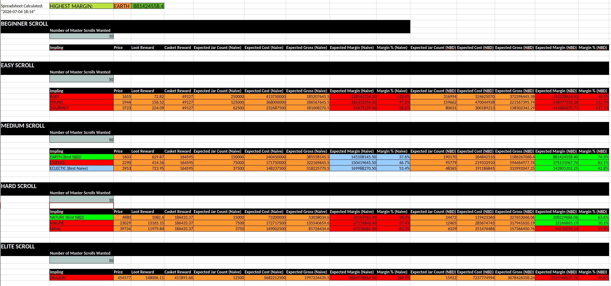
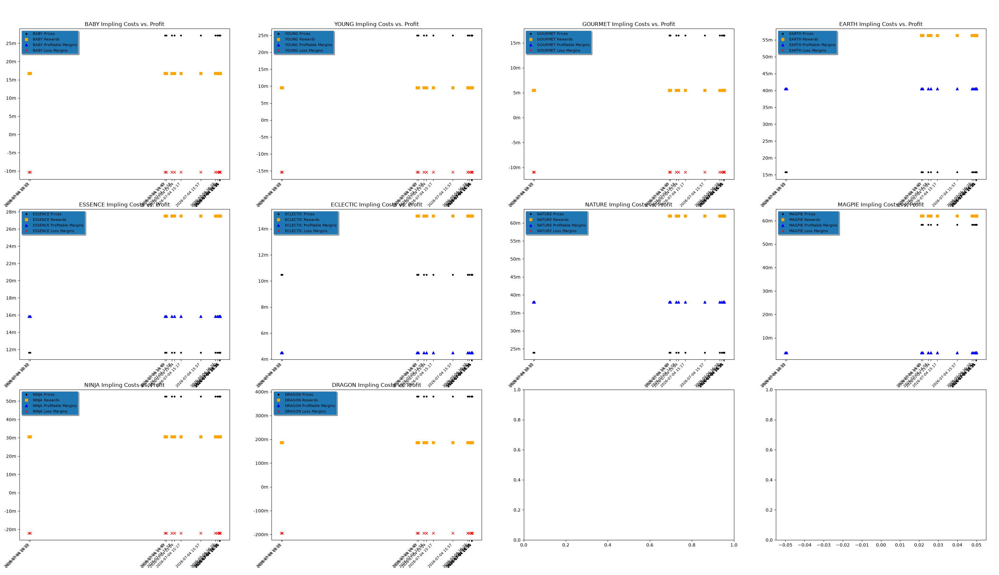

# Runescape Scroll Calculator

## Directory Structure
```
. [INSTALL_DIRECTORY]
├── calculation_storage.json
├── casket_chance_values.json
├── casket_timed_chance_values.json
├── casket_timed_values.json
├── casket_values.json
├── clue_scroll.xlsx
├── example.png
├── graphs.png
├── jar_values.json
├── readme.md
├── requirements.txt
├── RunescapeScrollCalculator.zip
├── src
│   ├── calculations
│   │   ├── calculation_strategies.py
│   │   ├── naive.py
│   │   └── negative_binomial_distribution.py
│   ├── config
│   │   └── config.py
│   ├── data
│   │   ├── calculation_storage.py
│   │   ├── caskets.py
│   │   ├── casket_storage.py
│   │   ├── implings.py
│   │   ├── impling_storage.py
│   │   ├── jar_storage.py
│   │   ├── loot_items.py
│   │   ├── lootitem_storage.py
│   │   ├── scroll_chance_storage.py
│   │   └── scrolls.py
│   ├── graph
│   │   ├── analyze_calculations.py
│   │   ├── graph_impling_values.py
│   │   └── main.py
│   ├── helpers
│   │   └── helpers.py
│   ├── jobs
│   │   ├── handle_data.py
│   │   ├── retrieve_casket_value.py
│   │   ├── retrieve_impling_value.py
│   │   ├── retrieve_jar_value.py
│   │   ├── retrieve_lootitem_value.py
│   │   ├── retrieve_scroll_chance.py
│   │   ├── store_casket_api_data.py
│   │   ├── store_impling_api_data.py
│   │   ├── store_jar_value.py
│   │   ├── store_lootitem_api_data.py
│   │   └── store_scroll_chance.py
│   ├── main.py
│   ├── spreadsheeting
│   │   ├── create_impling_value_spreadsheet.py
│   │   ├── create_lootitem_value_spreadsheet.py
│   │   ├── create_scroll_chances.py
│   │   └── __init__.py
│   └── test
│       └── nbd_check.py
└── timed_jar_values.json 
```

## Install Requirements
Requires `scipiy`, `requests`, `openpyxl`, and `matplotlib`.

`pip3 install -r requirements.txt`

Extract to `[INSTALL_DIRECTORY]`

## Running
```
cd [INSTALL_DIRECTORY]
python -m src.main
```

This builds a spreadsheet in `[INSTALL_DIRECTORY]` called `clue_scroll.xlsx`. This is where all the data gets viewed. After its generated, you can style how you choose, save it, and those formatting things will carry over. To grab new data, rerun the program and reopen the spreadsheet.

There are 3 sheets in total - `IMPLINGS`, `LOOT_ITEMS`, and `SCROLLS`. The first two sheets can be ignored, the only one with relevant data is `SCROLLS` is as below:



Graphing price and costs points can also be achieved.

`python -m src.graph.main`


